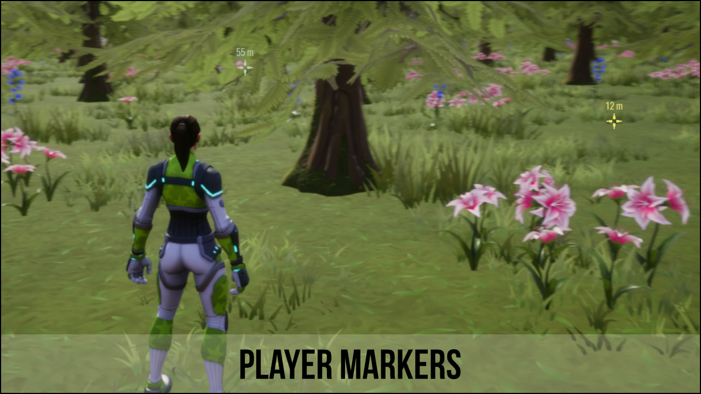
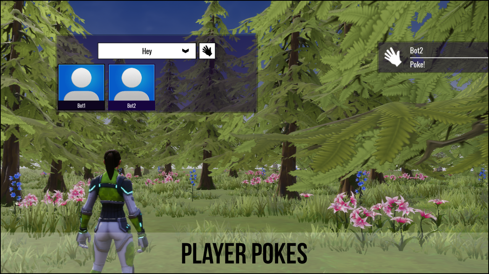

# Social Kit Documentation

Welcome to the documentation for the `Social Kit` found in [Core](https://coregames.com) Community Content.

This kit is all about players interacting and helping each other.  There are currently 3 components that all have a different way players can be more social in game.  All components can be drag and dropped into your hierarchy and they will work out of the box.  You can easily customise each component to suit your game.

If you want to get up and running quickly, then read the [Quick Start](quick-start) guide, otherwise I would recommend reading through the pages to learn more about the components and see which would be suited for your game.

