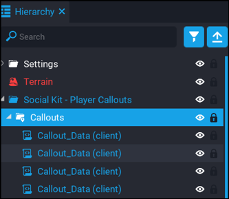
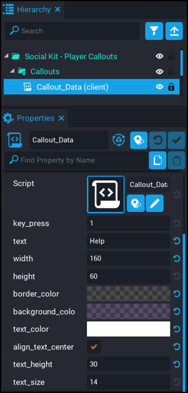

# Player Callouts - Creating Callouts

Creating your own custom callouts is really easy.  Follow the steps below and see the list of options to see how to set and customise your callouts.

1. To be able to create or remove callouts, you need to [deinstance](https://docs.coregames.com/tutorials/template_reference/#deinstance-a-template) the `Social Kit - Callouts` template in your hierarchy.

2. Expand the `Callouts` folder.  In here you will see all the default callouts that come with the component.  You can delete or edit the existing ones, and even add more.

3. A simple way to add more is to just duplicate the `Callout_Data` script and then modify it with your callout data.

Here are a list of what the settings do.

| Setting | Description |
| ------- | ----------- |
| `key_press` | The key press that will show this callout. |
| `text` | The text that will appear in the callout. |
| `width` | The width of the callout. |
| `height` | The height of the callout. |
| `border_color` | The color of the border around the callout. |
| `background_color` | The background color of the callout. |
| `text_color` | The color of the text in the callout. |
| `align_text_center` | If checked, the text in the callout will be aligned center, otherwise it will be aligned left. |
| `text_height` | The height of the text box.  Useful to adjust the text position so it appears more central in the bubble. |
| `text_size` | The size of the text. |