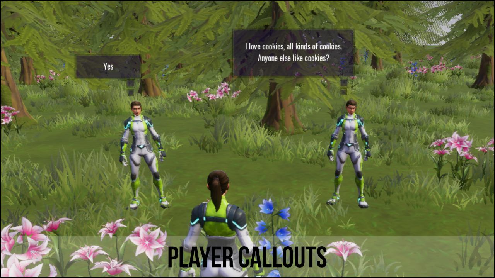

# Player Callouts - About Component

This component will allow players create a callout to other players on the server.  The callout will appear as a speech bubble above the players head.  This can be really useful if you are in a battle with enemies and maybe need healing or help and don't have time to use the chat box.

The component comes with 9 examples but you can easily modify / create your own to suit your own game.

Each callout has its own settings, so you can have different colors for certain callouts that may help get players attention.

Callouts have a cooldown so that players can't constantly spam callouts.  So only one callout can be on screen for the player.

Here is a list of the default callouts that come with the component.

| Key | Text |
| ------- | ---- |
| `1` | Help |
| `2` | Enemies here |
| `3` | I'm down |
| `4` | Yes |
| `5` | No |
| `6` | I need healing |
| `7` | Come here |
| `8` | There is loot here |
| `9` | I love cookies, all kinds of cookies.  Anyone else like cookies? |

