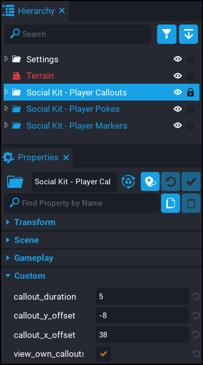

# Player Callouts - Settings

To change any of the settings for this component, click on the `Social Kit - Player Callouts` folder in your hierarchy.  You will then see a list of the settings in the properties.

| Setting | Description | 
| ------- | ----------- |
| `callout_duration` | How long a callout will be displayed on screen before it is removed. |
| `callout_y_offset` | The Y offset of the callout.  Useful if you need to adjust how high above the players head the callout is. |
| `callout_x_offset` | The X offset of the callout. |
| `view_own_callouts` | If enabled then you players will see their own callouts. |

