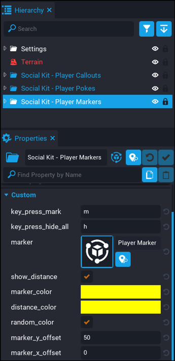

# Player Markers - Settings

To change any of the settings for this component, click on the `Social Kit - Player Markers` folder in your hierarchy.  You will then see a list of the settings in the properties.

| Setting | Description | 
| ------- | ----------- |
| `key_press_mark` | The key to create / remove a marker.  Default is `m`. |
| `key_press_hide_all` | The key to hide / show all markers.  Default is `h`. |
| `marker` | This is the marker template.  This can be customised if you want a different icon.  Look for `Player Marker` in your Project Content folder. |
| `show_distance` | If checked, then distances to markers will be shown. |
| `marker_color` | The color of the marker. |
| `distance_color` | The color of the distance text. |
| `random_color` | If checked, then the marker and distance text color will be random instead of using the above 2 options. |
| `marker_y_offset` | The Y offset from where the marker was placed.  Useful if you want it to appear lower or higher. |
| `marker_x_offset` | The X offset from where the marker was placed. |

