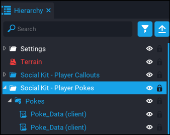
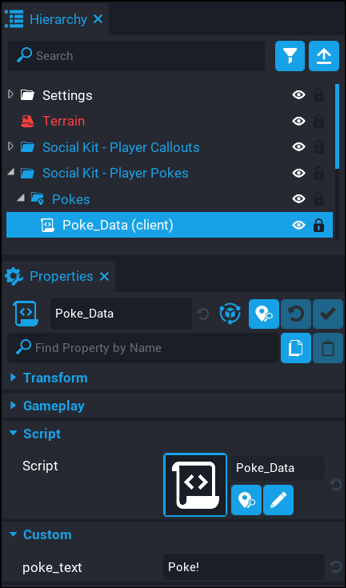

# Player Pokes - Creating Callouts

Creating your own custom pokes is really easy.  Follow the steps below.

1. To be able to create or remove pokes, you need to [deinstance](https://docs.coregames.com/tutorials/template_reference/#deinstance-a-template) the `Social Kit - Pokes` template in your hierarchy.

2. Expand the `Pokes` folder.  In here you will see all the default pokes that come with the component.  You can delete or edit the existing ones, and even add more.

3. A simple way to add more is to just duplicate the `Poke_Data` script and then modify it with your poke text.

| Setting | Description |
| ------- | ----------- |
| `poke_text` | The text that will appear in the dropdown in the Poke UI. |