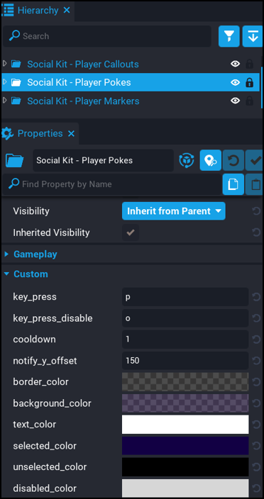

# Player Pokes - Settings

To change any of the settings for this component, click on the `Social Kit - Player Pokes` folder in your hierarchy.  You will then see a list of the settings in the properties.

| Setting | Description | 
| ------- | ----------- |
| `key_press` | The key that will be open and close the Poke UI.  Default is `p`. |
| `key_press_disable` | The key that will be used to disable all pokes.  Default is `o`. |
| `cooldown` | The amount of time before the player can send another poke. Set this higher if you want to reduce the amount of pokes being sent.  Setting this too low could annoy some players as it could promot spamming of pokes. |
| `notify_y_offset` | The UI Y offset of the poke notification.  The poke notification appears on the right side of the UI.  This setting controls how far down the left side of the screen the notification appears. |
| `border_color` | The color of the UI and notification border. |
| `background_color` | The background color of the UI and notification UI. |
| `text_color` | The text color of the notice and notification text. |
| `selected_color` | The color of the border when a player is selected. |
| `unselected_color` | The color of the border when a player is not selected. |
| `disabled_color` | The color of the dropdown and poke button when they are disabled. |

